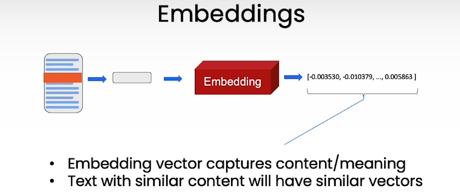
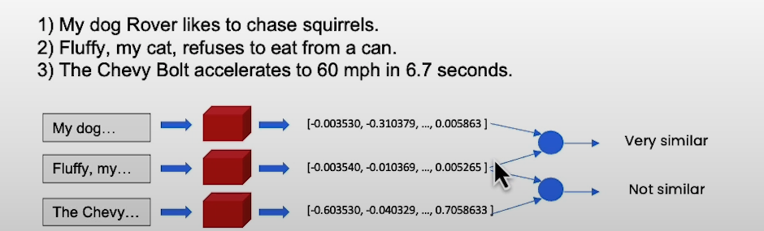
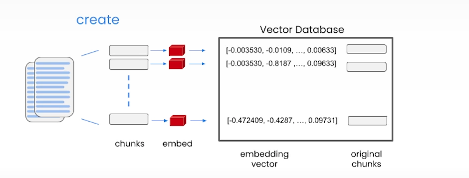
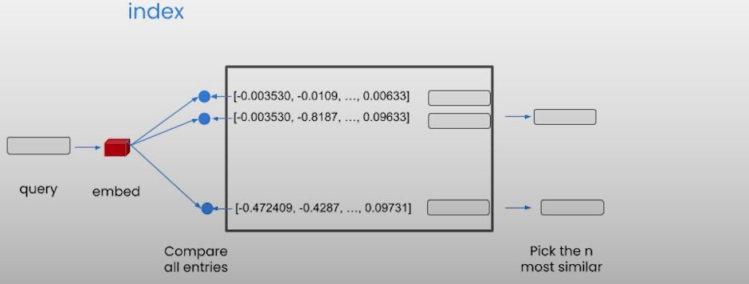
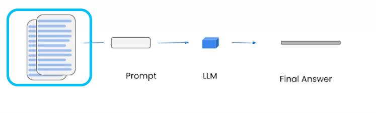
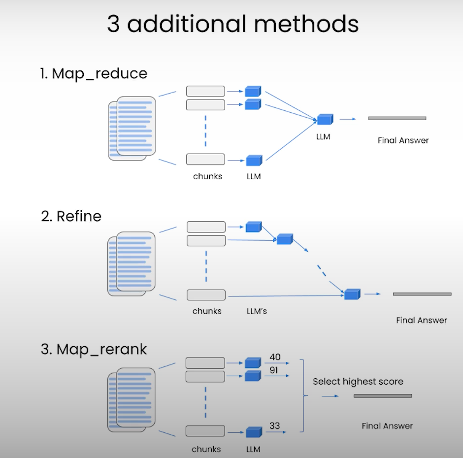
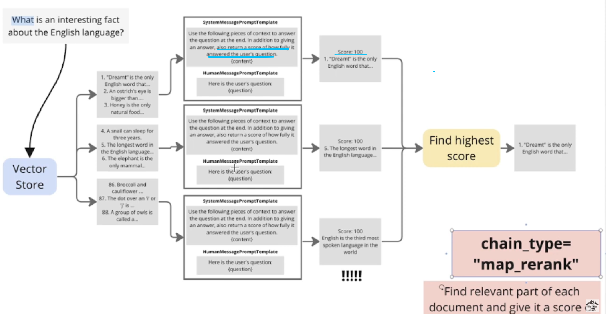

# LangChain: 문서 내용 기반 질의 응답
문서를 제공하고 그 안에서 검색 결과를 제공하는 방법에 대해서 배우겠다. 

## 사전 지식: 텍스트 임베딩
일단, 텍스트 임베딩이라는 개념부터 이해해보자. 컴퓨터는 자연어 텍스트를 이해할 수 없기에, 텍스트를 숫자로 바꾸는 과정이 필요하다. 텍스트 임베딩은 **텍스트를 벡터(숫자)로 바꾸는 과정**이다(👇 아래 그림 참고). 

  

이때 변환된 벡터를 '임베딩 벡터'라고 한다.  
**임베딩 벡터는 텍스트의 의미를 담고 있다.** 즉 비슷한 내용을 가진 텍스트들은 비슷한 값의 벡터로 매핑된다. 👇 아래의 예시를 보자. 

- 위의 그림에서 서로 비슷한 내용을 가진 1,2번 문장은 비슷한 숫자의 벡터로 매핑된다. 
- 이와 달리 서로 다른 내용을 가진 가진 1,3번 문장은 벡터 내의 숫자들이 차이가 있다. 

## 문서 내 질의응답 원리
1. **<U>벡터 DB</U>** 생성: 문서를 기반으로 벡터 DB를 생성한다.  
2. **<U>질의 응답</U>**: 벡터 DB를 기반으로 사용자의 질문(쿼리)에 적절한 답변을 생성한다. 

### 1) 벡터 DB 생성
벡터 DB는 임베딩된 벡터들을 담고 있는 DB 이다.  
사용자 질문(쿼리)에 답변할 준비를 하기 위해, 우리는 문서 내 모든 텍스트를 벡터로 변환한다. 다양한 유형의 문제를 풀 수 있도록 문제 은행을 만든다고 생각하면 편하다. 이러한 **임베딩 벡터들의 집합**을 벡터 DB라고 한다. 추후에 벡터 DB는 사용자 쿼리가 들어왔을 때, 문서에서 가장 유사도가 높은 부분을 출력하기 위해서 활용된다. 

#### 벡터 DB 만드는 과정 

> 1) chunking: 문서가 크기 때문에, 작은 덩어리인 chunk 단위로 문서를 나눈다(chunk를 배치라고도 한다). 
> 2) embedding: 각 청크 단위로 임베딩 벡터를 생성한다. 
> 3) VectorDB 생성: (생성된 임베딩 벡터, 원래의 chunk) 형식으로 DB에 저장

### 2) 질의응답
실제 사용자 쿼리를 받고, 벡터 DB를 기반으로 답변을 추출하는 과정이다. 

#### 질의응답 과정

> 1) 쿼리 임베딩(embed): 쿼리 텍스트를 vector로 변환한다. 
> 2) 비교(compare): 벡터 DB의 모든 요소들과 유사도를 계산한다.  
> 3) 결과: 벡터 DB에서 쿼리와 유사도가 가장 높은 N개의 청크를 선정한다.    

###  Summary 
> 문서 기반의 질의 응답은 다음의 방식으로 수행됨
> 1. 벡터 DB 생성(chunking -> embedding -> vectorDB에 저장)
> 2. 질의응답(쿼리 임베딩 -> vectorDB 내 모든 원소들과 유사도 계산 -> 젤 유사한 N개 문서 선정)

## langchain으로 구현해보기 
크게 3가지 단계로 구성되어 있다. 
> (1) 벡터 DB를 만든다.   
> (2) retriever(검색기)를 만든다.   
> (3) retriverQA 체인을 만든다.   

### (1) 벡터 DB 만들기 

~~~python 
db = DocArrayInMemorySearch.from_documents(
    docs, 
    embeddings
)
~~~
- parameters
    - `docs`에 내가 원하는 문서 지정
    - `embedding`: 내가 원하는 임베딩 방식을 지정

### (2) retriever(검색기) 생성
~~~
retriever = db.as_retriever()
~~~

### (3) retriverQA 체인 생성
~~~
qa_chain = RetrievalQA.from_chain_type(
    llm=llm, 
    chain_type="stuff", 
    retriever=retriever, 
    verbose=True
)
~~~
## 긴 문서를 검색하는 전략
긴 문서 혹은 여러 개의 문서들이 주어질 때 우리는 어떻게 검색해야할지 고민이 된다. 
`chain_type`은 이럴 때, 벡터 DB에서 **사용자 쿼리에 대한 답변을 생성하는 방식**을 결정하는 파라미터이다. 

### 1. stuff
기본적으로 랭체인은 stuff 형식의 검색 방법을 쓴다. 
`stuff`는 모든 문서를 1개의 문서로 합쳐서 검색을 수행한다.  

  
 
- 장점: 일반적으로 간단하고 빠르다. 
- 단점 
    - **문서의 길이가 길면 사용 불가**: 문서 용량이 너무 클 경우에 LLM 모델 입력 토큰 제한이 걸릴 수 있다. 
    - **낮은 정확도**: 입력 토큰 제한이 없더라도 모든 문서를 한 번에 처리하기 때문에, 중요한 정보가 제대로 반영되지 않거나 답변의 세밀함이 떨어질 수 있음.   

 
문서의 길이가 너무 길 경우, 우리는 문서를 배치단위로 나누는 방식들이 있는데 다음과 같이 3가지가 있다. 

## `map_reduce`(병렬적)
문서를 배치 단위로 나눈 후 LLM 모델에 전달한다. 그리고 각 결과들을 합산하여 최종 답변을 도출한다. 
- 장점: 문서의 양에 제한 받지 않고 없이 수행 가능, 병렬적 처리가 되기 때문에 비교적 빠르다 cf) refine
- 단점: 마지막에 전체 모델 결과들을 요약하는 횟수가 있기에 refine 보다 LLM API 호출 횟수가 많음

## `refine`(순차적)
순차적으로 이전 모델의 요약 결과를 다음 모델에 전달하면서 결과 도출 
- 장점: 문장의 맥락을 유지하면서 긴 문서를 요약 가능(높은 신뢰성), 단계적 처리가 필요한 문제에 적합하다.
- 단점: 호출이 독립적이지 않고 LLM을 순차적으로 호출해야하기 때문에 시간이 많이 걸림

## **`map_rerank`**(병렬적, 점수 기반)
각 배치에 모델을 적용한 결과 점수를 추출 -> 최고점을 가진 문서를 채택
- 점수는 아래의 그림과 같이 LLM 모델을 호출 시 prompt에 점수를 계산해달라는 내용을 포함한다. 
  - 

- 장점
    - (vs 벡터 DB) 벡터 DB는 거리를 기반으로 쿼리와 유사한 답변을 찾는다. 그러나 map_rerank의 경우 LLM API를 통해서 ??? 
    - 따라서 벡터 임베딩과 함꼐 사용하면 보완할 수 있다.
- 단점
    - 문서 간 정보를 결합하지 않기 때문에, 정보 결합을 요구하는 복합적 질문 유형 대해서 응답하기는 쉽지 않다. 
        - 예를 들어 문서 1은 강아지의 품종에 대한 이야기이고, 문서 2는 고양이의 품종을 담고 있음
        - 이때 map rank를 통해서 'Q. A 강아지 품종 A와 비슷한 성격을 가진 고양이는 어떤게 있어?" 와 같이 서로 다른 문서 내 정보를 결합해야하는 질문에는 응답하지 못한다. 
    - 여러 차례 LLM 호출 비용 증가

# References
- https://learn.deeplearning.ai/courses/langchain/lesson/5/question-and-answer
- https://www.youtube.com/watch?v=BWRdNRa-gqI

